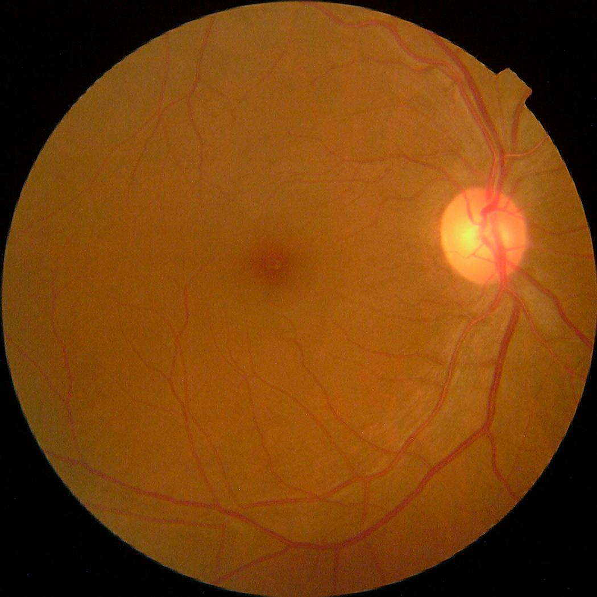
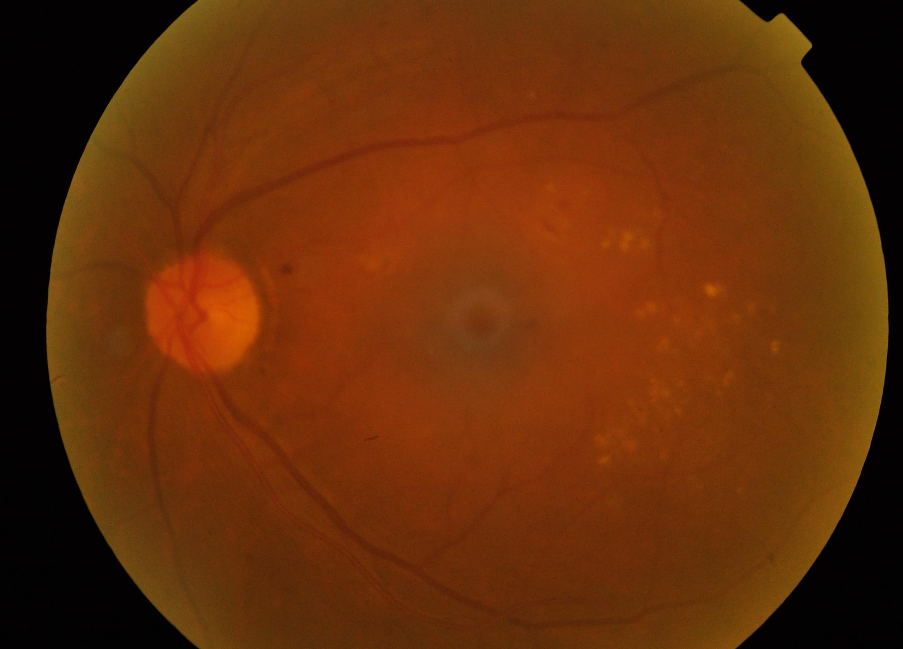
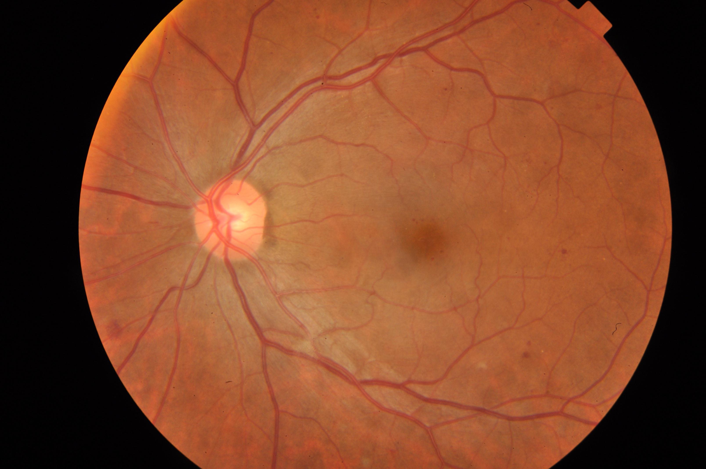
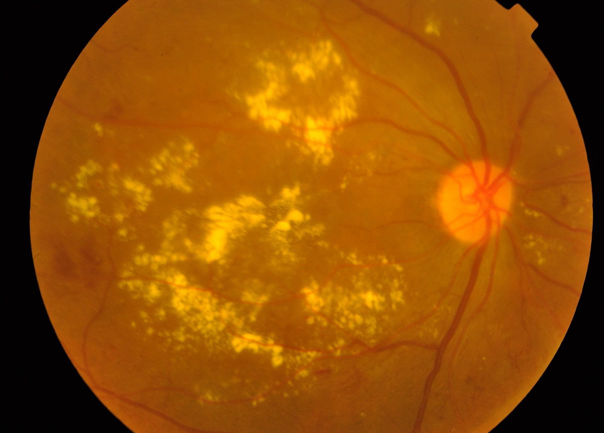
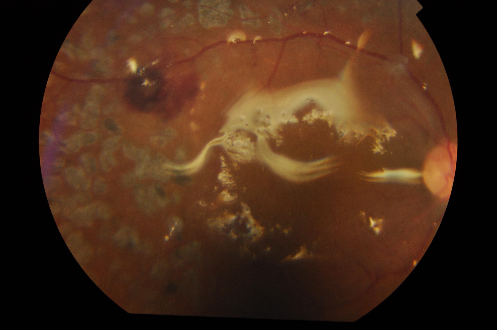
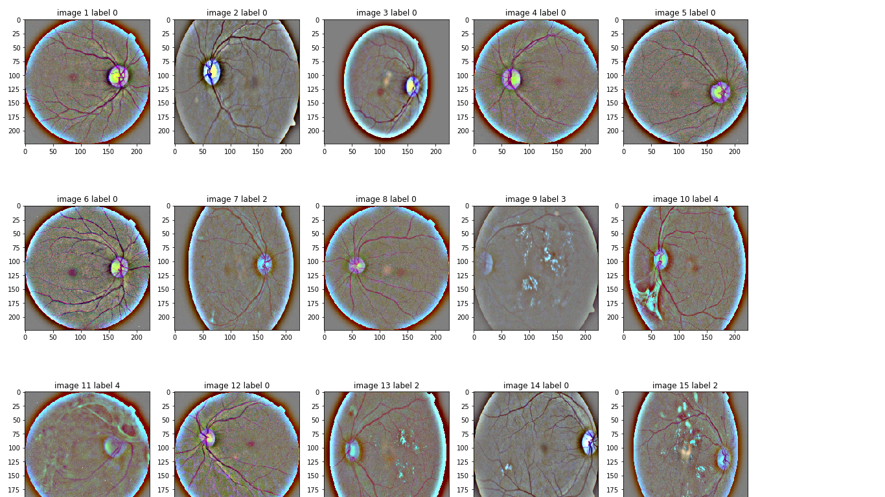
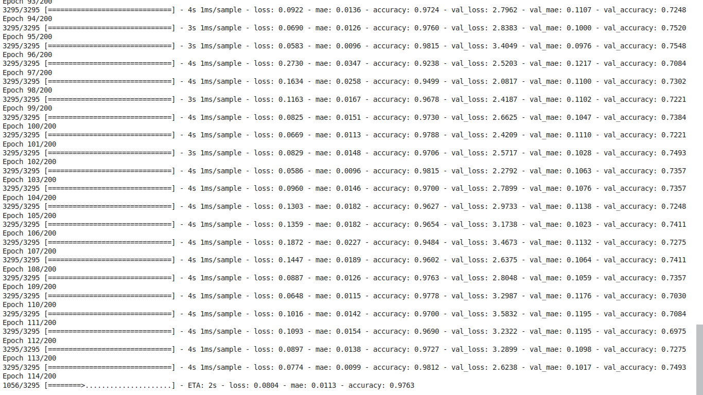

# Detection of Diabetic Retinopathy which leads to Blindness

## Project Summary
Our project is a tool that can be used to classify the different types of diabetic
eye. It classifies the eye into one of the five classes on the basis of the location
of the spot, nature of the veins. The five classes are as follows:-

#### Class 0: No abnormalities, Normal eye.

#### Class 1: Mild NPDR( nonproliferative diabetic retinopathy), this is the beginning of diabetic retinopathy, small blood clots start forming in the eye.

#### Class 2: Moderate NPDR, is when the condition starts deteriorating blood spot accumulates in the center between the lens and the retina which starts preventing the light rays from reaching the retina and hence the vision starts getting blur.: 

#### Class 3: Severe NPDR, Definite venous beading is seen as well as the number of blood spots also increase and spread randomly across the eye.

#### Class 4: Proliferative diabetic, this is the most severe stage of diabetic retinopathy in this stage the veins starts to crumble as well as bleeding is observed and hence no light is able to hit the retina and the vision gets completely blocked. 

### Things to learn
This repository will help you to learn about the different layers of the deep learning models that we used and the coding aspects related to deep learning. There is a step-by-step guide with outputs in all of the notebook files. So you don't have to worry about the results.

## Some screenshots of the results of our project

##

##

##
  

##
